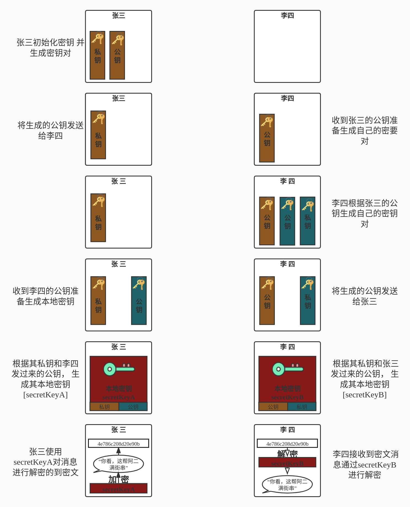

# DH (Diffie-Hellman)算法

**原理图**

`为了满足PFS安全要求，安全传输更多使用DH算法来在客户端、服务器之间动态交换密钥M。`

`DH算法每隔一段时间需要重新re-key，re-key就是重新协商双方共享密钥M，所以通信双方的共享密钥是周期性变更的。即使破解了其中一个M，依然需要相同的力气破解其它的M，只有所有M都破解了，才能得到完整的用户数据。`

`通俗地说，安全性就是通过制造更多的障碍，大大增加任何未授权的第三方破解难度。只要破解成本大于数据本身的成本，就不会有人再干这亏本的买卖！`
